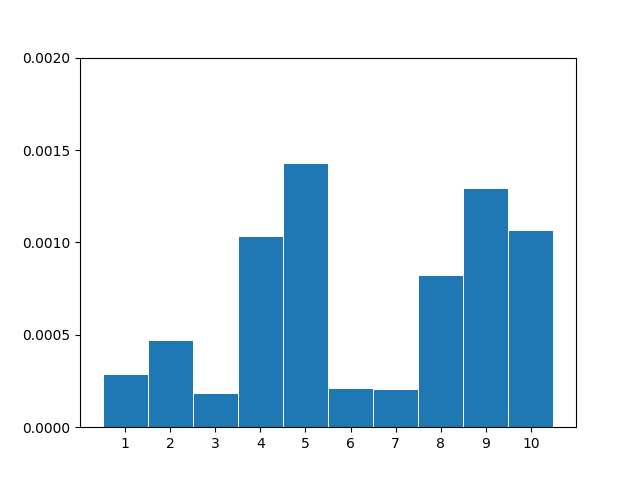

# Highest Value Longest Common Subsequence (HVLCS)

## Student Information
- Name: Chuyang Zhang
- UFID: 29981529

---

## Project Description
This project implements an algorithm to compute the **Highest Value Longest Common Subsequence (HVLCS)** between two strings.

Given:
- Two strings `A` and `B`
- A set of characters with assigned values

The goal is to:
1. Compute the maximum total value of a common subsequence.
2. Output one subsequence that achieves this value.

---

Repository Structure
```
.
├── assets/         # Assets
├── src/            # Source code
├── input/          # Input files
├── output/         # Output files
├── tests/          # Test files
├── README.md       # README file
├── .gitignore      # gitignore
```

---

## Requirements / Dependencies
- Language: [Python 3.12.7]
- Libraries: [numpy, matplotlib, time, random]
---


## How to Run


### General Command

Run in terminal to pull the terminal
```bash
git pull https://github.com/476C6974636842797465/PA3.git
```

Go to folder and from there create a python environment
```bash
python -m venv env
```

Activate the env environment (Windows)
```bash
source env/bin/activate
```

Activate the env environment (Mac)
```bash
source env/bin/activate
```

Install dependencies
```bash
pip install matplotlib
```

Run the python file
```bash
python src/PA3.py
```

---

## Input Format
```
K
x1 v1
x2 v2
...
xK vK
A
B
```

- `K`: Number of characters
- Each `(xi, vi)`: character and its value
- `A`, `B`: input strings

---

## Output Format
```
s
v
t
```
- `s` is the optimal subsequence
- `v` is the value of the subsequence
- `t` is the time to finish the algorithm

---

## Example

### Input (`data/example.in`)
```
3
a 2
b 4
c 5
aacb
caab
```

### Output (`printed`)
```
9
cb
(time)
```

---

## Reproducing Results
To reproduce the example:

uncomment the test function at line 93 and comment everything else in the main. Run the python file to see the results with the same commnad

Expected output:
```
9
cb
1.1205673217773438e-05
```

---

## ⚠️ Assumptions
- Character values are non-negative integers
- Input format strictly follows the specification
- If multiple optimal subsequences exist, any one is returned
- Each charactr is in the alphabet
- Spaces in the files are corrected and files are formatted correctly
- All 10 files exists
- Words are more than 25 or more characters long
---


## Question 1: Empirical Comparison

Use at least 10 nontrivial input files (i.e., contain strings of length at least 25). Graph the
runtime of the 10 files.

### Results
| File | Final Value | Time (seconds) | Subsequence |
| :--- | :--- | :--- | :--- |
| **1** | 1404 | 0.00029015541076660156 | `ssssssssssssssssssssssssssssssssssssssssssssssssssss` |
| **2** | 2318 | 0.0004699230194091797 | `rmoozmozmztpopoepnozoentpeozoymmo` |
| **3** | 776 | 0.00018715858459472656 | `jlfaljlloollmll` |
| **4** | 2936 | 0.0010328292846679688 | `osmmsosssmoosomossssossooossssoosomossmsmoosoosssosossoo` |
| **5** | 1620 | 0.0014309883117675781 | `axxuoaxmrzkfkalfkxxmzqfllzalokkckllxllcaf` |
| **6** | 932 | 0.00021386146545410156 | `wjqsowxxyxmtxsw` |
| **7** | 706 | 0.0002040863037109375 | `ybmrpebfekicylkq` |
| **8** | 1513 | 0.0008242130279541016 | `lagbmptggvaftuabffspafgttuwvpg` |
| **9** | 1443 | 0.0012960433959960938 | `lmxtdbdfmwqjfmfjwbxxovffqfcmqd` |
| **10** | 1909 | 0.001065969467163086 | `ckcocpacccjzctfkkcokocctccocoooc` |

### Graph


---

## Question 2: Recurrence Equation

Give a recurrence that is the basis of a dynamic programming algorithm to compute the
HVLCS of strings A and B. You must provide the appropriate base cases, and explain why
your recurrence is correct.

### Recurrence
```
If A[i] == B[j]:
    dp[i][j] = (
        dp[i-1][j-1] + value(A[i])
    )
Else:
    dp[i][j] = max(
        dp[i-1][j],
        dp[i][j-1]
    )
```

### Base Cases
```
dp[0][j] = 0
dp[i][0] = 0
```

This recurrence is correct because it accounts for if the values match and if the values do not match. If it matches it would add the dictionary value of the character and if it doesn't it would find the maximum value of which specific subsequence would bring the maximum value. The maximum value would be the corner of the 2D array because it would find all the maximum values of every combination of whether we choose the character or not. This would start the beginning of the string and build up to find every combination starting from 2 strings of zero size to their length of the string and build up to utimately track the different combinations as the substrings start to become similar to the original strings.


---

## Question 3: Algorithm & Big-O

Give pseudocode of an algorithm to compute the length of the HVLCS of given strings A
and B. What is the runtime of your algorithm?

### Pseudocode
```
Initialize dp table of size (n+1) x (m+1)

for i from 1 to n:
    for j from 1 to m:
        if A[i] == B[j]:
            dp[i][j] = max(dp[i-1][j], dp[i][j-1], dp[i-1][j-1] + value(A[i]))
        else:
            dp[i][j] = max(dp[i-1][j], dp[i][j-1])

return dp[n][m]
```

### Time Complexity
```
O(n * m)
```

### Space Complexity
```
O(n * m)
```
